<div align="center">
<hr>

# SuperCoolJobs

<ins>**_SOFE3700U final project_**</ins>

<ins>_Wednesday, November 22, 2023_</ins>

**Deployed @ [http://jeremymark.ca/](http://jeremymark.ca/)**

| Name                    | Student Number |
| ----------------------- | -------------- |
| Jeremy Mark Tubongbanua | 100849092      |
| Noah Toma               | 100825559      |
| Nehmat Farooq           | 100819864      |
| Jerry Shum              | 100845217      |

_Group No.: 9_

_CRN: 43511_

</div>
<br>

<div align="center">

## Description

SuperCoolJobs is a full-stack application that allows candidates, recruiters, and companies to network and engage in the job application process. Candidates can apply to jobs, recruiters can post jobs, and companies can hire recruiters to post jobs on their behalf. Candidates, in turn, can place job applications, and recruiters are able to place, view, and modify job postings. Finally, companies have the ability to view their recruiters and their job postings.

</div>
<br>

<div align="center">

## Structure

</div>
<br>

```
.
├── api/
│   ├── Api.js (entrypoint for External API)
│   └── ...
├── sql/
│   ├── api_queries/recruit/
│   ├── creation/
│   ├── deletion/
│   ├── insertions/
│   ├── job_postings
│   ├── show_tables/
│   ├── views/
│   └── restart_everything.sql (Refresh data)
└── web/
    ├── public/
    ├── src/
    └── package.json
```

<div align="center">

## Installation

The two major components, the website and the external API, are located in the web and api folders respectively. They can both be initiated via conventional npm scripts.

|                                    Requirements                                    |
| :--------------------------------------------------------------------------------: |
| [NodeJS](https://nodejs.org/en/) (LTS is recommended; NPM is included with NodeJS) |

</div>
<br>

<div align="center">

### Running the External API

Linux

Simply enter the directory, install the dependencies, and run the start script.

```sh
cd api
npm i
npm run start
```

### Running the Application

Linux

Simply enter the directory, install the dependencies, and run the start script.

```sh
cd web
npm i
npm run start
```

## Table Creations

```
CREATE TABLE IF NOT EXISTS `job_posting_type` (
    id INTEGER NOT NULL UNIQUE,
    job_posting_type TEXT NOT NULL,
    PRIMARY KEY (id)
);
CREATE TABLE IF NOT EXISTS `job_posting_frequency` (
    id INTEGER NOT NULL UNIQUE,
    job_posting_frequency TEXT NOT NULL,
    PRIMARY KEY (id)
);
CREATE TABLE IF NOT EXISTS `recruit_status` (
    id INTEGER NOT NULL UNIQUE,
    recruit_status TEXT NOT NULL,
    PRIMARY KEY (id)
);
CREATE TABLE IF NOT EXISTS `job_application_status` (
    id INTEGER NOT NULL UNIQUE,
    job_application_status TEXT NOT NULL,
    PRIMARY KEY (id)
);
CREATE TABLE IF NOT EXISTS `profession` (
    id INTEGER NOT NULL UNIQUE,
    profession VARCHAR(255) NOT NULL,
    PRIMARY KEY (id)
);
CREATE TABLE IF NOT EXISTS `company` (
    id INTEGER NOT NULL UNIQUE,
    company_name VARCHAR(255) NOT NULL,
    company_description TEXT NOT NULL,
    company_location VARCHAR(255),
    logo TEXT,
    PRIMARY KEY (id)
);
CREATE TABLE IF NOT EXISTS `job_posting` (
    id INTEGER NOT NULL UNIQUE,
    company_id INTEGER NOT NULL,
    job_posting_title VARCHAR(255) NOT NULL,
    job_posting_description TEXT NOT NULL,
    salary INTEGER,
    picture TEXT,
    job_posting_status_id INTEGER NOT NULL,
    job_posting_type_id INTEGER NOT NULL,
    job_posting_frequency_id INTEGER NOT NULL,
    FOREIGN KEY (company_id) REFERENCES company (id),
    FOREIGN KEY (job_posting_type_id) REFERENCES job_posting_type (id),
    FOREIGN KEY (job_posting_status_id) REFERENCES job_posting_status (id),
    PRIMARY KEY (id)
);
CREATE TABLE IF NOT EXISTS `recruit` (
    id INTEGER NOT NULL UNIQUE,
    u_name VARCHAR(255) NOT NULL UNIQUE,
    pass_hash VARCHAR(255) NOT NULL,
    full_name VARCHAR(255) NOT NULL,
    recruit_location VARCHAR(255),
    bio TEXT,
    picture TEXT,
    recruit_resume TEXT,
    recruit_status_id INTEGER NOT NULL,
    PRIMARY KEY (id),
    FOREIGN KEY (recruit_status_id) REFERENCES recruit_status (id)
);
CREATE TABLE IF NOT EXISTS `recruiter` (
    id INTEGER NOT NULL UNIQUE,
    company_id INTEGER,
    u_name VARCHAR(255) NOT NULL UNIQUE,
    pass_hash VARCHAR(255) NOT NULL,
    full_name VARCHAR(255) NOT NULL,
    recruiter_location VARCHAR(255),
    bio TEXT,
    picture TEXT,
    FOREIGN KEY (company_id) REFERENCES company (id),
    PRIMARY KEY (id)
);
CREATE TABLE IF NOT EXISTS `job_application` (
    recruit_id INTEGER NOT NULL,
    job_posting_id INTEGER NOT NULL,
    job_application_status_id INTEGER NOT NULL,
    FOREIGN KEY (recruit_id) REFERENCES recruit (id),
    FOREIGN KEY (job_posting_id) REFERENCES job_posting (id),
    FOREIGN KEY (job_application_status_id) REFERENCES job_application_status (id),
    PRIMARY KEY (recruit_id, job_posting_id)
);
CREATE TABLE `recruit_professions` (
    recruit_id INTEGER NOT NULL,
    profession_id INTEGER NOT NULL,
    FOREIGN KEY (recruit_id) REFERENCES recruit (id),
    FOREIGN KEY (profession_id) REFERENCES profession (id),
    PRIMARY KEY (recruit_id, profession_id)
);
CREATE TABLE `job_posting_professions` (
    job_posting_id INTEGER NOT NULL,
    profession_id INTEGER NOT NULL,
    FOREIGN KEY (job_posting_id) REFERENCES job_posting (id),
    FOREIGN KEY (profession_id) REFERENCES profession (id),
    PRIMARY KEY (job_posting_id, profession_id)
);
```

## Insertions

```sql
INSERT INTO `job_posting_status` (id, job_posting_status)
VALUES (0, 'Closed'),
    (1, 'Open');
INSERT INTO `job_posting_type` (id, job_posting_type)
VALUES (0, 'Remote'),
    (1, 'Hybrid'),
    (2, 'In-Person');
INSERT INTO `job_posting_frequency` (id, job_posting_frequency)
VALUES (0, 'Contract'), (1, 'Part-Time'), (2, 'Full-Time');
INSERT INTO `recruit_status` (id, recruit_status)
VALUES (0, 'Not Looking for Jobs'),
    (1, 'Looking for Jobs');
INSERT INTO `job_application_status` (id, job_application_status)
VALUES (0, 'Rejected'),
    (1, 'Pending'),
    (2, 'Accepted');
INSERT INTO `profession` (id, profession)
VALUES
    (0, 'Software Engineering'),
    (1, 'Data Engineering'),
    (2, 'Mechanical Engineering'),
    (3, 'Accounting'),
    (4, 'Finance'),
    (5, 'Marketing'),
    (6, 'Sales'),
    (7, 'Human Resources'),
    (8, 'Customer Service'),
    (9, 'Data Science'),
    (10, 'Data Analytics'),
    (12, 'Machine Learning'),
    (13, 'Data Mining'),
    (14, 'Electrical Engineering'),
    (15, 'Education'),
    (16, 'Cooking'),
    (17, 'Big Data'),
    (18, 'High School Math');
INSERT INTO `company` (
        id,
        company_name,
        company_description,
        company_location,
        logo
    )
VALUES (
        0,
        'Ontario Tech University',
        'Ontario''s fastest growing engineering university',
        '2000 Simcoe Street North, Oshawa, Ontario, Canada',
        'https://pbs.twimg.com/profile_images/1110951821579829253/weqEaAsM_400x400.png'
    ),
    (
        1,
        'Google',
        'Google LLC is an American multinational technology company that specializes in Internet-related services and products.',
        '111 Richmond Street West Toronto, Ontario, Canada',
        'https://blog.hubspot.com/hubfs/image8-2.jpg'
    ),
    (
        2,
        'Meet Sushi and Boil',
        'We make some pretty good sushi',
        '3595 Sheppard Ave East , Toronto, Ontario',
        'https://imgur.com/vwwGPgT'
    ),
    (
        3,
        'Ontario Power Generation',
        'We power the province of Ontario',
        'Ontario, Canada',
        'https://imgur.com/3ccTKp1'
    ),
    (
        4,
        'Amazon',
        '123 Seaseme Street, Montreal, Canada',
        'Amazon web services',
        'https://m.media-amazon.com/images/G/15/gc/designs/livepreview/amazon_dkblue_noto_email_v2016_ca-main._CB468775011_.png'
    ),
    (
        5,
        'Microsoft',
        'Microsoft made the Windows operating system',
        '4400-81 Bay St Toronto, ON M5J 0E7',
        'https://upload.wikimedia.org/wikipedia/commons/thumb/4/44/Microsoft_logo.svg/2048px-Microsoft_logo.svg.png'
    ),
    (
        6,
        'Code Ninjas',
        'We teach students virtually in all areas from elementary to high school STEM education.',
        NULL,
        'https://imgur.com/pIwUCIg'
    ),
    (
        7,
        'Atsign',
        'We are a SV start up building Networking 2.0 technology securing networkign devices by making them addressable wherever and whenever, closing ports on vulnerable networking devices and making firewalls truly firewalls, and giving data privacy back to the people of the Internet.',
        NULL,
        'https://encrypted-tbn0.gstatic.com/images?q=tbn:ANd9GcTkPMc4PJz4LMaNNb63G0-QW5OvNwljP81qTsdIL5e8&s'
    );
INSERT INTO `job_posting` (
        id,
        company_id,
        job_posting_title,
        job_posting_description,
        salary,
        picture,
        job_posting_status_id,
        job_posting_type_id,
        job_posting_frequency_id
    )
VALUES
    (0, 0, 'Software Engineering Associate Professor','A professor with a Software and Electrical background and a PhD in Engineering', 180000,'https://images.pexels.com/photos/716276/pexels-photo-716276.jpeg?auto=compress&cs=tinysrgb&w=1260&h=750&dpr=1',0, 2, 2),
    (1,0,'Data Management Lab Instructor','A Master''s student with a strong software and databases background.', 90000, 'https://images.pexels.com/photos/7173026/pexels-photo-7173026.jpeg?auto=compress&cs=tinysrgb&w=1260&h=750&dpr=1', 1, 2, 1),
    (2, 1, 'Project Manager', 'Someone to manage the google developers in their weekly scrum meetings and facilitate team activity and meetings.', 50000, 'https://images.pexels.com/photos/3183150/pexels-photo-3183150.jpeg?auto=compress&cs=tinysrgb&w=1260&h=750&dpr=1', 1, 0, 0),
    (3, 2, 'Sushi Chef', 'Someone with 3+ years of experience in making sushi', 80000, 'https://images.pexels.com/photos/8951199/pexels-photo-8951199.jpeg?auto=compress&cs=tinysrgb&w=1600', 1, 2, 2),
    (4, 2, 'Cashier', 'Someone to talk to customers, count money, and pass food from kitchen to front desk', 35000, 'https://images.pexels.com/photos/702251/pexels-photo-702251.jpeg?auto=compress&cs=tinysrgb&w=1600', 1, 2, 2),
    (5, 2, 'Part-Time Cashier', 'Someone to talk to customers, count money, and pass food from kitchen to front desk', 20000, 'https://images.pexels.com/photos/702251/pexels-photo-702251.jpeg?auto=compress&cs=tinysrgb&w=1600', 1, 2, 1),
    (6, 4, 'Project Manager', 'Facilitate weekly scrums and lead developers to meet quartlery deadlines', 90000, 'https://images.pexels.com/photos/416405/pexels-photo-416405.jpeg?auto=compress&cs=tinysrgb&w=1260&h=750&dpr=1', 1, 0, 2),
    (7, 4, 'Assistant Project Manager', 'Facilitate weekly scrums and lead developers to meet quartlery deadlines', 60000, 'https://images.pexels.com/photos/416405/pexels-photo-416405.jpeg?auto=compress&cs=tinysrgb&w=1260&h=750&dpr=1', 1, 0, 0),
    (8, 4, 'Clerk', 'Facilitate weekly scrums and lead developers to meet quartlery deadlines', 60000, 'https://images.pexels.com/photos/5965705/pexels-photo-5965705.jpeg?auto=compress&cs=tinysrgb&w=1600', 0, 1, 2),
    (9, 5, 'Software Developer', 'Professional developer with 5+ years experience  attuned with ASP.NET', 100000, 'https://images.pexels.com/photos/574071/pexels-photo-574071.jpeg?auto=compress&cs=tinysrgb&w=1260&h=750&dpr=1', 1, 0, 2),
    (10, 5, 'Software Developer', 'Professional developer with 5+ years experience  attuned with ASP.NET', 100000, 'https://images.pexels.com/photos/574071/pexels-photo-574071.jpeg?auto=compress&cs=tinysrgb&w=1260&h=750&dpr=1', 1, 0, 2),
    (11, 5, 'Software Developer', 'Professional developer with 5+ years experience  attuned with ASP.NET', 100000, 'https://images.pexels.com/photos/574071/pexels-photo-574071.jpeg?auto=compress&cs=tinysrgb&w=1260&h=750&dpr=1', 0, 0, 2),
    (12, 6, 'Elementary-Level Math Tutor', 'Familiar with basic math such as calculating the circumference and area of a circle.', 8000, 'https://images.pexels.com/photos/3771074/pexels-photo-3771074.jpeg?auto=compress&cs=tinysrgb&w=1600', 1, 1, 1),
    (13, 6, 'Elementary-Level English Tutor', 'Looking for a concurrent university student with English level 10.', 8000, 'https://images.pexels.com/photos/256417/pexels-photo-256417.jpeg?auto=compress&cs=tinysrgb&w=1260&h=750&dpr=1', 1, 1, 1),
    (14, 6, 'Elementary-Level Science Tutor', 'Looking for a concurrent university student with basic knowledge of biology, chemistry, and physics.', 8000, 'https://images.pexels.com/photos/2280571/pexels-photo-2280571.jpeg?auto=compress&cs=tinysrgb&w=1600', 1, 1, 1),
    (15, 6, 'High School Math Tutor', 'Familiar with calculus and vectors', 10000, 'https://images.pexels.com/photos/6238050/pexels-photo-6238050.jpeg?auto=compress&cs=tinysrgb&w=1600', 1, 1, 1),
    (16, 6, 'High School Science Tutor', 'Familiar with calculus and vectors', 10000, 'https://images.pexels.com/photos/6238050/pexels-photo-6238050.jpeg?auto=compress&cs=tinysrgb&w=1600', 1, 1, 1),
    (17, 7, 'Software Intern', 'A current college/university student who wants to help give the Internet its privacy back, familiar with C and/or Dart.', 10000, 'https://encrypted-tbn0.gstatic.com/images?q=tbn:ANd9GcTkPMc4PJz4LMaNNb63G0-QW5OvNwljP81qTsdIL5e8&s', 1, 0, 0),
    (18, 7, 'Software Intern', 'A current college/university student who wants to help give the Internet its privacy back, familiar with C and/or Dart.', 10000, 'https://encrypted-tbn0.gstatic.com/images?q=tbn:ANd9GcTkPMc4PJz4LMaNNb63G0-QW5OvNwljP81qTsdIL5e8&s', 1, 0, 0),
    (19, 7, 'Software Intern', 'A current college/university student who wants to help give the Internet its privacy back, familiar with C and/or Dart.', 10000, 'https://encrypted-tbn0.gstatic.com/images?q=tbn:ANd9GcTkPMc4PJz4LMaNNb63G0-QW5OvNwljP81qTsdIL5e8&s', 1, 0, 0),
    (20, 7, 'Marketing Intern', 'A current college/university student who wants to help give the Internet its privacy back, familiar with making videos or still graphics.', 10000, 'https://images.pexels.com/photos/936135/pexels-photo-936135.jpeg?auto=compress&cs=tinysrgb&w=1600', 1, 0, 0),
    (21, 7, 'Marketing Intern', 'A current college/university student who wants to help give the Internet its privacy back, familiar with making videos or still graphics.', 10000, 'https://images.pexels.com/photos/936135/pexels-photo-936135.jpeg?auto=compress&cs=tinysrgb&w=1600', 1, 0, 0),
    (22, 7, 'Marketing Intern', 'A current college/university student who wants to help give the Internet its privacy back, familiar with making videos or still graphics.', 10000, 'https://images.pexels.com/photos/936135/pexels-photo-936135.jpeg?auto=compress&cs=tinysrgb&w=1600', 1, 0, 0),
    (23, 1, 'Frontend Developer','An experienced developer with a strong background in JavaScript, HTML, and CSS.', 80000, 'https://images.pexels.com/photos/3183150/pexels-photo-3183150.jpeg?auto=compress&cs=tinysrgb&w=1260&h=750&dpr=1', 1, 2, 1),
    (24, 2, 'Backend Developer','A developer with a strong background in server-side languages like Python or Java.', 85000, 'https://images.pexels.com/photos/716276/pexels-photo-716276.jpeg?auto=compress&cs=tinysrgb&w=1260&h=750&dpr=1', 0, 2, 2),
    (25, 2, 'Full Stack Developer', 'A developer with a strong background in both frontend and backend development.', 90000, 'https://images.pexels.com/photos/7173026/pexels-photo-7173026.jpeg?auto=compress&cs=tinysrgb&w=1260&h=750&dpr=1', 1, 2, 0);

INSERT INTO `recruit` (id, u_name, pass_hash, full_name, recruit_location, bio, picture, recruit_resume, recruit_status_id)
VALUES
    (0, 'x23mark', '123', 'Jeremy Tubongbanua', 'Scarborough, Ontario, Canada', '3rd-Year Software Engineering Student Specializaing in IoT', 'https://i.imgur.com/SbwZN0K.png', 'https://www.linkedin.com/in/jeremy-tubongbanua/', 0),
    (1, 'jerryshum', 'de877b38b46ff2a81533394464d8c7ae', 'Jerry Shum', 'Oshawa, Ontario, Canada', '3rd-Year Software Engineering Student', 'https://i.imgur.com/fxfajwb.png', 'https://www.linkedin.com/in/jerry-shum/', 1),
    (2, 'neh2332', '123', 'Nehmat Farooq', 'Oshawa, Ontario, Canada', '3rd-Year Software Engineering Student | Aspiring Software Engineer | Gym Enjoyer', 'https://i.imgur.com/aqSgVKF.png', 'https://www.linkedin.com/in/nehmat-farooq/', 1),
    (3, 'dudeman', 'de877b38b46ff2a81533394464d8c7ae', 'Noah Toma', 'Ajax, Ontario, Canada', '3rd-Year Software Engineering Student | Certified Goat', 'https://static.wikia.nocookie.net/character-stats-and-profiles/images/2/2f/Robloxian_3D_Png.png/revision/latest?cb=20230629111153', 'https://www.linkedin.com/in/nt-se/', 0),
    (4, 'moker', '123', 'Wesley Kyle De Guzman', 'Scarborough, Ontario, Canada', '3rd-Year Mechatronics Engineering Student at Ontario Tech University', 'https://i.imgur.com/BGzXDUd.png', 'https://www.linkedin.com/in/wesley-de-guzman-46529b207/', 1),
    (5, 'kh', 'de877b38b46ff2a81533394464d8c7ae', 'Khalid Hafeez', 'Ontario, Canada', 'Associate Professor at Ontario Tech University', 'https://shared.ontariotechu.ca/shared/faculty/feas/images/faculty-photos/khalid.hafeez.png', 'https://engineering.ontariotechu.ca/people/ecse/khalid.hafeez.php', 0),
    (6, 'billgates', '123', 'Bill Gates', 'San Jose, California', 'Founder of Microsoft', 'https://upload.wikimedia.org/wikipedia/commons/thumb/f/fc/Bill_Gates_-_2023_-_P062021-967902_%28cropped%29.jpg/330px-Bill_Gates_-_2023_-_P062021-967902_%28cropped%29.jpg', 'https://en.wikipedia.org/wiki/Bill_Gates', 0),
    (7, 'kevinwang', 'de877b38b46ff2a81533394464d8c7ae', 'Kevin Wang', 'Rome, Italy', 'Associate Professor of Finance at Rotman', 'https://i.imgur.com/A8bcvUF.png', 'https://www.rotman.utoronto.ca/FacultyAndResearch/Faculty/FacultyBios/Wang_K', 1),
    (8, 'nadeemkhan', '123', 'Nadeem Khan', 'Milton, Ontario, Canada', 'Masters of Business & Administration', 'https://media.licdn.com/dms/image/D5603AQHtJa0cVGbFfQ/profile-displayphoto-shrink_200_200/0/1699807793764?e=1705536000&v=beta&t=hkfCkrgDRVP2nMDbO7w6NdrUG3uTCTGFHTT2939hiD4', 'https://www.linkedin.com/in/nadeem-khan-6a8a87241/', 0);

INSERT INTO `recruiter` (id, company_id, u_name, pass_hash, full_name, recruiter_location, bio, picture) VALUES
    (0, 0, 'recruiter1', '123', 'John Doe', 'Oshawa, Ontario, Canada', 'Recruiter at Ontario Tech University', 'https://i.imgur.com/0B738gb.png'),
    (1, 1, 'recruiter2', '123', 'Jane Doe', 'Toronto, Ontario, Canada', 'Recruiter at Google', 'https://i.imgur.com/0B738gb.png'),
    (2, 2, 'recruiter3', '123', 'John Doe', 'Toronto, Ontario, Canada', 'Recruiter at Meet Sushi and Boil', 'https://i.imgur.com/0B738gb.png'),
    (3, 3, 'recruiter4', '123', 'Jane Doe', 'Toronto, Ontario, Canada', 'Recruiter at Ontario Power Generation', 'https://i.imgur.com/0B738gb.png'),
    (4, 4, 'recruiter5', '123', 'John Doe', 'Montreal, Quebec, Canada', 'Recruiter at Amazon', 'https://i.imgur.com/0B738gb.png'),
    (5, 5, 'recruiter6', '123', 'Jane Doe', 'Toronto, Ontario, Canada', 'Recruiter at Microsoft', 'https://i.imgur.com/0B738gb.png'),
    (6, 6, 'recruiter7', '123', 'John Doe', 'Toronto, Ontario, Canada', 'Recruiter at Code Ninjas', 'https://i.imgur.com/0B738gb.png'),
    (7, 7, 'recruiter8', '123', 'Jane Doe', 'Toronto, Ontario, Canada', 'Recruiter at Atsign', 'https://i.imgur.com/0B738gb.png');

INSERT INTO `job_application` (recruit_id, job_posting_id, job_application_status_id)
VALUES
    (0, 1, 1),
    (0, 2, 1),
    (0, 3, 1),
    (0, 4, 1),
    (0, 5, 1),
    (0, 12, 1),
    (0, 14, 0),
    (1, 0, 0),
    (1, 1, 1),
    (1, 6, 2),
    (1, 7, 2),
    (1, 10, 1),
    (1, 11, 1),
    (1, 19, 1),
    (2, 0, 0),
    (2, 1, 0),
    (2, 2, 0),
    (2, 3, 2),
    (2, 4, 2),
    (2, 5, 2),
    (2, 6, 1),
    (2, 7, 2),
    (2, 8, 2),
    (2, 9, 1),
    (2, 10, 2),
    (2, 11, 1),
    (2, 12, 1),
    (2, 13, 1),
    (2, 14, 2),
    (2, 15, 1),
    (2, 16, 1),
    (2, 17, 1),
    (2, 18, 1),
    (2, 19, 1),
    (2, 20, 1),
    (2, 21, 1),
    (4, 20, 2),
    (5, 0, 1),
    (7, 17, 1),
    (7, 18, 1),
    (7, 19, 1),
    (7, 20, 1),
    (7, 21, 1),
    (7, 22, 1);

INSERT INTO `recruit_professions` (recruit_id, profession_id)
VALUES (0, 0),
(1, 0),
(2, 0),
(3, 0),
(3, 15),
(4, 5),
(4, 7),
(5, 0),
(5, 1),
(5, 14),
(6, 0),
(7, 4),
(7, 8);

INSERT INTO `job_posting_professions` (job_posting_id, profession_id)
VALUES
    (0, 0),
    (0, 1),
    (0, 15),
    (1, 0),
    (1, 1),
    (1, 15),
    (2, 6),
    (2, 9),
    (2, 10),
    (3, 8),
    (3, 16),
    (4, 8),
    (5, 8),
    (6, 1),
    (6, 5),
    (6, 7),
    (7, 7),
    (8, 7),
    (8, 8),
    (8, 10),
    (9, 0),
    (9, 1),
    (9, 9),
    (9, 17),
    (10, 0),
    (11, 0),
    (12, 15),
    (12, 18),
    (13, 15),
    (13, 18),
    (14, 15),
    (15, 15),
    (16, 15),
    (17, 0),
    (17, 12),
    (18, 0),
    (18, 1),
    (19, 0),
    (19, 5),
    (20, 5),
    (21, 5),
    (22, 5);
```

## Views

### View 1 - View all recruits and the job titles they’ve applied to

```sql
CREATE VIEW view1 AS (
    SELECT recruit.id, recruit.u_name, recruit.full_name, job_application.job_posting_id, job_posting.job_posting_title
    FROM recruit JOIN job_application ON recruit.id = job_application.recruit_id JOIN job_posting ON job_application.job_posting_id = job_posting.id
);
```

### View 2 - see average job salary that each recruiter applied to

```sql
CREATE VIEW view2 AS (
    SELECT r.recruit_id, r.recruit_name, AVG(j.job_salary) AS average_salary
    FROM recruits r
    INNER JOIN applications a ON r.recruit_id = a.recruit_id
    INNER JOIN jobs j ON a.job_id = j.job_id
    GROUP BY r.recruit_id, r.recruit_name
);
```

### View 3 - View all the job_posting_ids of the people who applied to job postings which had a greater salary than 65000. must use a correlated nested query

```sql
CREATE VIEW view3 AS (
    SELECT recruits.id AS rid, recruits.u_name, recruits.full_name, job_posting.id AS jpid, job_posting.salary FROM (SELECT recruit.id, recruit.u_name, recruit.full_name
    FROM recruit JOIN (SELECT *
    FROM job_application
    WHERE job_posting_id IN (
        SELECT id
        FROM job_posting
        WHERE salary > 30000
    )) AS job_apps ON recruit.id = job_apps.recruit_id) AS recruits, job_posting
    WHERE recruits.id = job_posting.id
    ORDER BY recruits.id
);
```

### View 4 - Show all information between a recruit and all the job applications they’ve applied to

```sql
CREATE VIEW view4 AS (
    SELECT * FROM recruit
    LEFT JOIN job_application ON recruit.id = job_application.recruit_id

    UNION

    SELECT * FROM job_application
    RIGHT JOIN recruit ON job_application.recruit_id = recruit.id
);
```

### View 5 - Shows all usernames of all accounts in the system

```sql
CREATE VIEW view5 AS (
    (
        SELECT r.u_name
        FROM recruit r
    )
    UNION ALL
    (
        SELECT re.u_name
        FROM recruiter re
    )
);
```

### View 6 - See what company each recruiter in the system works for

```sql
CREATE VIEW view6 AS (
    SELECT recruiter.full_name 'Recruiter',
        company.company_name 'Company'
    FROM recruiter
        JOIN company ON recruiter.company_id = company.id
);
```

### View 7 - Company, job offering, type, and salary, ordered by company name in ascending order

```sql
CREATE VIEW view7 AS (
    SELECT C.company_name 'Company',
        J.job_posting_title 'Job Title',
        O.job_posting_type 'Job Type',
        J.salary 'Salary'
    FROM job_posting J
        JOIN company C ON J.company_id = C.id
        JOIN job_posting_type O ON J.job_posting_type_id = O.id
);
```

### View 8 - Recruits that are currently hired

```sql
CREATE VIEW view8 AS(
    SELECT recruit.id, recruit.u_name, recruit.full_name, recruit_status.recruit_status FROM recruit JOIN recruit_status ON recruit.recruit_status_id = recruit_status.id AND recruit_status.recruit_status LIKE 'Not Looking for Jobs'
    ORDER BY recruit.id ASC
);

```

### View 9 - Recruits that are looking for work and have uploaded a resume

```sql
CREATE VIEW view9 AS (
    SELECT recruit.full_name,
        recruit_status.recruit_status
    FROM recruit
        JOIN recruit_status ON recruit.recruit_status_id = recruit_status.id
    WHERE recruit_status.recruit_status LIKE 'Looking for Jobs'
        AND recruit.recruit_resume IS NOT NULL
);
```

### View 10

```sql
CREATE VIEW view10 AS (
    SELECT J.job_posting_title 'Job Title',
        J.salary 'Salary'
    FROM job_posting J
    WHERE J.salary > (
            SELECT AVG(salary)
            FROM job_posting
        )
    ORDER BY J.salary DESC
);
```

### View 11 - view all the job_postings that each company has posted

```sql
CREATE VIEW view11 AS (
    SELECT company.id AS 'company_id', job_posting.id AS 'job_posting_id'
    FROM company JOIN job_posting ON company.id = job_posting.company_id
);
```

### View 12 - show all usernames, password hashes, as well as what type of account they are (recruit or recruiter)

```sql
CREATE VIEW view12 AS (
    (
        SELECT r.u_name, r.pass_hash, 'recruit' AS account_type
        FROM recruit r
    )
    UNION ALL
    (
        SELECT re.u_name, re.pass_hash, 'recruiter' AS account_type
        FROM recruiter re
    )
);
```

## Table Samples

### Company Table

Each tuple represents a company and contains the company’s details

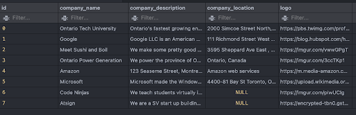

### Job Application Table

Holds a relationship between a recruit, the job posting they applied for, and holds the job application status.

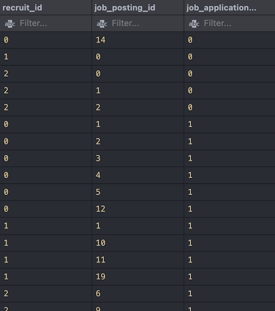

### Job Application Status Table

A job application can have a status, “rejected”, “pending”, or “accepted”. Each of the ids link the query to the associated string.

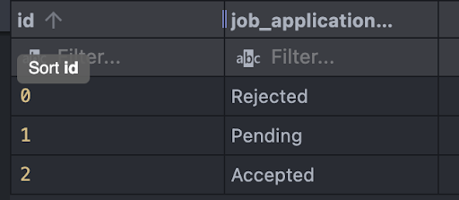

### Job Posting Table

Each tuple represents a job posting that consists of a job posting, which has a company_id (which company the job posting was posted by), the job posting title, description, and salary

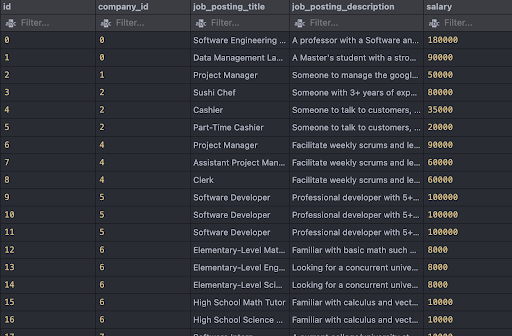

### Job Posting Frequency Table

The job posting frequency table links the id to a string

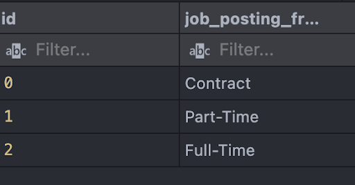

### Job Posting Professions Table

Each Job Posting contains a list of professions. This table links a job posting to which professions it relates to.

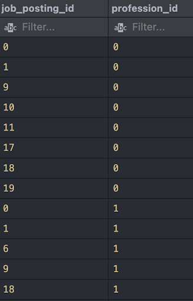

### Job Posting Status Table

Every job posting can have a status (open or closed). The job posting itself will have one of these ids as one of its columns.

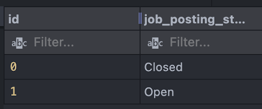

### Job Posting Type Table

Every job posting h as one type. The job posting itself will have one of these ids as one of its columns.

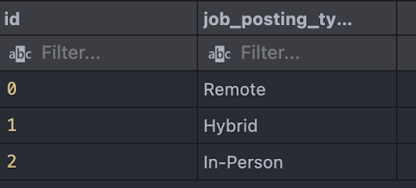

### Profession Table

Unique list of all registered and valid professions in our application

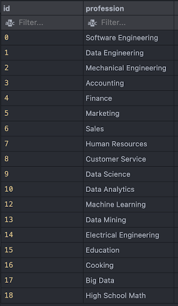

### Recruit Table

Contains all the recruits in the application (account).

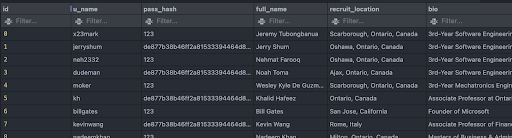

### Recruit Professions Table

Each recruit may associate themselves under a certain profession on their profile. This table handles this relationship.

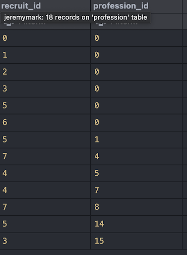

### Recruit Status Table

A recruit may declare themselves as looking for a job or not looking for a job

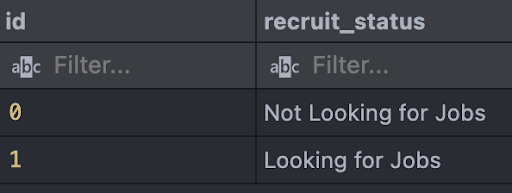

### Recruiter Table

Similar to recruit table, each tuple represents an account in our system

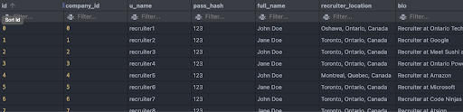

## External API Specification

### (1) Job_postings

#### (1.1) Get Job Posting By Company Id

- **Method:** POST
- **Endpoint:** `/company/job_postings`
- **Request Body:**
  ```json
  {
    "id": 1
  }
  ```
- **Response Body (Sample):**
  ```json
  {
    "message": "success",
    "data": [
      {
        "id": 2,
        "company_id": 1,
        "job_posting_title": "Project Manager",
        "job_posting_description": "Someone to manage the google developers in their weekly scrum meetings and facilitate team activity and meetings.",
        "salary": 50000,
        "picture": "https://images.pexels.com/photos/3183150/pexels-photo-3183150.jpeg?auto=compress&cs=tinysrgb&w=1260&h=750&dpr=1",
        "job_posting_status": "Open",
        "job_posting_type": "Remote",
        "job_posting_frequency": "Contract",
        "professions": ["Sales", "Data Science", "Data Analytics"]
      }
      // ... (complete data structure)
    ]
  }
  ```

#### (1.2) Get Job Posting By Id

- **Method:** POST
- **Endpoint:** `/job_posting/id`
- **Headers:**
  ```json
  {
    "Content-Type": "application/json"
  }
  ```
- **Request Body:**
  ```json
  {
    "id": 3
  }
  ```
- **Response Body (Sample):**
  ```json
  {
    "message": "success",
    "data": {
      "id": 3,
      "company_id": 2,
      "company_name": "Meet Sushi and Boil",
      "job_posting_title": "Sushi Chef",
      "job_posting_description": "Someone with 3+ years of experience in making sushi",
      "salary": 80000,
      "picture": "https://images.pexels.com/photos/8951199/pexels-photo-8951199.jpeg?auto=compress&cs=tinysrgb&w=1600",
      "job_posting_status": "Open",
      "job_posting_type": "In-Person",
      "job_posting_frequency": "Full-Time",
      "professions": ["Customer Service", "Cooking"]
    }
  }
  ```

#### (1.3) Get All Job Postings

- **Method:** POST
- **Endpoint:** `/job_postings`
- **Headers:**
  ```json
  {
    "Content-Type": "application/json"
  }
  ```
- **Request Body:**
  ```json
  {}
  ```
- **Response Body (Sample):**
  ```json
  {
    "message": "success",
    "data": [
      {
        "id": 0,
        "company_id": 0,
        "company_name": "Ontario Tech University",
        "job_posting_title": "Software Engineering Associate Professor",
        "job_posting_description": "A professor with a Software and Electrical background and a PhD in Engineering",
        "salary": 180000,
        "picture": "https://images.pexels.com/photos/716276/pexels-photo-716276.jpeg?auto=compress&cs=tinysrgb&w=1260&h=750&dpr=1",
        "job_posting_status": "Closed",
        "job_posting_type": "In-Person",
        "job_posting_frequency": "Full-Time",
        "professions": ["Software Engineering", "Data Engineering", "Education"]
      }
      // ... (complete data structure)
    ]
  }
  ```

### (1.4) Get Job Posting By Filter

- **Method:** POST
- **Endpoint:** `/job_posting/filter`
- **Headers:**
  ```json
  {
    "Content-Type": "application/json"
  }
  ```
- **Request Body:**
  ```json
  {
    "job_posting_titles": [],
    "company_names": [],
    "professions": [],
    "salary": {
      "min": 0,
      "max": 1999999
    },
    "job_posting_statuses": [],
    "job_posting_types": [],
    "job_posting_frequencies": ["Part-Time"]
  }
  ```
- **Response Body (Sample):**
  ```json
  {
    "message": "success",
    "data": [
      {
        "id": 1,
        "company_id": 0,
        "company_name": "Ontario Tech University",
        "job_posting_title": "Data Management Lab Instructor",
        "job_posting_description": "A Master's student with a strong software and databases background.",
        "salary": 90000,
        "picture": "https://images.pexels.com/photos/7173026/pexels-photo-7173026.jpeg?auto=compress&cs=tinysrgb&w=1260&h=750&dpr=1",
        "job_posting_status": "Open",
        "job_posting_type": "In-Person",
        "job_posting_frequency": "Part-Time",
        "professions": ["Software Engineering", "Data Engineering", "Education"]
      }
      // ... (complete data structure)
    ]
  }
  ```

## (2) Company

### (2.1) Get Company By Id

- **Method:** POST
- **Endpoint:** `/company/id`
- **Headers:**
  ```json
  {
    "Content-Type": "application/json"
  }
  ```
- **Request Body:**
  ```json
  {
    "id": 2
  }
  ```
- **Response Body (Sample):**
  ```json
  {
    "message": "success",
    "data": {
      "id": 2,
      "company_name": "Meet Sushi and Boil",
      "company_description": "We make some pretty good sushi",
      "company_location": "3595 Sheppard Ave East , Toronto, Ontario",
      "logo": "https://imgur.com/vwwGPgT",
      "job_postings": [3, 4, 5, 24, 25],
      "recruiters": [2]
    }
  }
  ```

### (2.2) Get All Companies

- **Method:** POST
- **Endpoint:** `/companies`
- **Headers:**
  ```json
  {
    "Content-Type": "application/json"
  }
  ```
- **Request Body:**
  ```json
  {}
  ```
- **Response Body (Sample):**
  ```json
  {
    "message": "success",
    "data": [
      {
        "id": 0,
        "company_name": "Ontario Tech University",
        "company_description": "Ontario's fastest growing engineering university",
        "company_location": "2000 Simcoe Street North, Oshawa, Ontario, Canada",
        "logo": "https://pbs.twimg.com/profile_images/1110951821579829253/weqEaAsM_400x400.png"
      },
      {
        "id": 1,
        "company_name": "Google",
        "company_description": "Google LLC is an American multinational technology company that specializes in Internet-related services and products.",
        "company_location": "111 Richmond Street West Toronto, Ontario, Canada",
        "logo": "https://blog.hubspot.com/hubfs/image8-2.jpg"
      },
      {
        "id": 2,
        "company_name": "Meet Sushi and Boil",
        "company_description": "We make some pretty good sushi",
        "company_location": "3595 Sheppard Ave East , Toronto, Ontario",
        "logo": "https://imgur.com/vwwGPgT"
      }
      // ... (complete data structure)
    ]
  }
  ```

## (3) Recruit

### (3.1) Get Recruit By Id

- **Method:** POST
- **Endpoint:** `/recruit/id`
- **Headers:**
  ```json
  {
    "Content-Type": "application/json"
  }
  ```
- **Request Body:**
  ```json
  {
    "id": 0
  }
  ```
- **Response Body (Sample):**
  ```json
  {
    "message": "success",
    "data": {
      "id": 0,
      "u_name": "x23mark",
      "pass_hash": "123",
      "full_name": "Jeremy Tubongbanua",
      "recruit_location": "Scarborough, Ontario, Canada",
      "bio": "3rd-Year Software Engineering Student Specializing in IoT",
      "picture": "https://i.imgur.com/SbwZN0K.png",
      "recruit_resume": "https://www.linkedin.com/in/jeremy-tubongbanua/",
      "recruit_status": "Not Looking for Jobs",
      "professions": ["Software Engineering"]
    }
  }
  ```

### (3.2) Get All Recruits

- **Method:** GET
- **Endpoint:** `/recruits`
- **Headers:**
  ```json
  {
    "Content-Type": "application/json"
  }
  ```
- **Request Body:**
  ```json
  {}
  ```
- **Response Body (Sample):**
  ```json
  {
    "message": "success",
    "data": [
      {
        "id": 0,
        "u_name": "x23mark",
        "pass_hash": "123",
        "full_name": "Jeremy Tubongbanua",
        "recruit_location": "Scarborough, Ontario, Canada",
        "bio": "3rd-Year Software Engineering Student Specializing in IoT",
        "picture": "https://i.imgur.com/SbwZN0K.png",
        "recruit_resume": "https://www.linkedin.com/in/jeremy-tubongbanua/",
        "recruit_status": "Not Looking for Jobs",
        "professions": ["Software Engineering"]
      }
      // ... (complete data structure)
    ]
  }
  ```

### (3.3) Get Recruit By u_name

- **Method:** POST
- **Endpoint:** `/recruit/u_name`
- **Headers:**
  ```json
  {
    "Content-Type": "application/json"
  }
  ```
- **Request Body:**
  ```json
  {
    "u_name": "jeremy"
  }
  ```
- **Response Body (Sample):**
  ```json
  {
    "message": "success",
    "data": {
      "id": 0,
      "u_name": "x23mark",
      "pass_hash": "123",
      "full_name": "Jeremy Tubongbanua",
      "recruit_location": "Scarborough, Ontario, Canada",
      "bio": "3rd-Year Software Engineering Student Specializing in IoT",
      "picture": "https://i.imgur.com/SbwZN0K.png",
      "recruit_resume": "https://www.linkedin.com/in/jeremy-tubongbanua/",
      "recruit_status": "Not Looking for Jobs",
      "professions": ["Software Engineering"]
    }
  }
  ```

### (3.4) Put New Recruit

- **Method:** POST
- **Endpoint:** `/recruit`
- **Headers:**
  ```json
  {
    "Content-Type": "application/json"
  }
  ```
- **Request Body:**
  ```json
  {
    "u_name": "el28",
    "pass_hash": "de877b38b46ff2a81533394464d8c7ae",
    "full_name": "Emily Lai",
    "recruit_location": "Aurora, Ontario",
    "bio": "Hi, I am Emily Lai, the VP of Finance & Administration of OT EngSoc",
    "picture": "https://media.licdn.com/dms/image/D5603AQGXKuUJ-RGsRQ/profile-displayphoto-shrink_200_200/0/1677041538074?e=1705536000&v=beta&t=oJwqQcdXkPSl5tlXQ2nmasNq0KGXOZVyneO4EHy-F48",
    "recruit_resume": "https://www.linkedin.com/in/-emily-lai/",
    "recruit_status_id": 1
  }
  ```
- **Response Body (Sample):**
  ```json
  {
    "message": "success",
    "data": {
      "fieldCount": 0,
      "affectedRows": 1,
      "insertId": 0,
      "info": "",
      "serverStatus": 2,
      "warningStatus": 0,
      "changedRows": 0
    }
  }
  ```

### (3.5) Patch Recruit

- **Method:** POST
- **Endpoint:** `/recruit`
- **Headers:**
  ```json
  {
    "Content-Type": "application/json"
  }
  ```
- **Request Body:**
  ```json
  {
    "id": 0,
    "u_name": "x23mark112"
  }
  ```
- **Response Body (Sample):**
  ```json
  {
    "message": "success",
    "data": {
      "fieldCount": 0,
      "affectedRows": 1,
      "insertId": 0,
      "info": "Rows matched: 1  Changed: 1  Warnings: 0",
      "serverStatus": 2,
      "warningStatus": 0,
      "changedRows": 1
    }
  }
  ```

## (4) Recruiter

### (4.1) Put New Recruiter

- **Method:** PUT
- **Endpoint:** `/recruiter`
- **Headers:**

  ```json
  {
    "Content-Type": "application/json"
  }
  ```

- **Request Body:**

  ```json
  {
    "company_id": 0,
    "u_name": "el28",
    "pass_hash": "1234",
    "full_name": "Nehmat F",
    "recruiter_location": "Oshawa, Ontario",
    "bio": "Cool guy",
    "picture": "123"
  }
  ```

- **Response Body (Sample):**

```json
{
  "message": "success",
  "data": {
    "fieldCount": 0,
    "affectedRows": 1,
    "insertId": 0,
    "info": "",
    "serverStatus": 2,
    "warningStatus": 0,
    "changedRows": 0
  }
}
```

### (4.2) Patch Recruiter

- **Method**: PATCH
- **Endpoint**: /recruiter
- **Headers**:

```json
{ "Content-Type": "application/json" }
```

- **Request Body:**

```json
{
  "id": 0,
  "company_id": 0,
  "u_name": "jeremy",
  "pass_hash": "123",
  "full_name": "Jeremy",
  "bio": "I am Jeremy, a recruiter",
  "picture": "456"
}
```

- **Response Body (Sample):**

```json
{
  "message": "success",
  "data": {
    "fieldCount": 0,
    "affectedRows": 1,
    "insertId": 0,
    "info": "Rows matched: 1 Changed: 1 Warnings: 0",
    "serverStatus": 2,
    "warningStatus": 0,
    "changedRows": 1
  }
}
```

### (4.3) Get Recruiter

- **Method**: POST
- **Endpoint**: /recruiter/u_name
- **Headers**:

```json
{ "Content-Type": "application/json" }
```

- **Request Body:**

```json
{
  "u_name": "recruiter1"
}
```

- **Response Body (Sample):**

```json
{
  "message": "success"
}
```

### (5) Recruiter

### (5.1) Put New Recruiter

- **Method**: PUT
- **Endpoint**: /recruiter
- **Headers**: Content-Type: application/json
- **Request**

````json
Body: { "company_id": 0, "u_name": "el28", "pass_hash": "1234", "full_name": "Nehmat F", "recruiter_location": "Oshawa, Ontario", "bio": "Cool guy", "picture": "123" } ```
- **Response** ```json Body (Sample): { "message": "success", "data": { "fieldCount": 0, "affectedRows": 1, "insertId": 0, "info": "", "serverStatus": 2, "warningStatus": 0, "changedRows": 0 } }
````

### (5.2) Patch Recruiter

- **Method**: PATCH
- **Endpoint**: /recruiter
- **Headers**: Content-Type: application/json
- **Request**

```json
 Body: { "id": 0, "company_id": 0, "u_name": "jeremy", "pass_hash": "123", "full_name": "Jeremy", "bio": "I am Jeremy, a recruiter", "picture": "456" }
```

- **Response**

```json
Body (Sample): { "message": "success", "data": { "fieldCount": 0, "affectedRows": 1, "insertId": 0, "info": "Rows matched: 1 Changed: 1 Warnings: 0", "serverStatus": 2, "warningStatus": 0, "changedRows": 1 } }
```

### (5.3) Get Recruiter

- **Method**: POST
- **Endpoint**: /recruiter/u_name
- **Headers**: Content-Type: application/json
- **Request**

```json
Body: { "u_name": "recruiter1" }
```

- **Response**

```json
Body (Sample): { "message": "success" }
```

(6) Job Application
(6.1) Recruit Apply For Job Posting
Method: PUT
Endpoint: /job_application/recruitapply
Headers: Content-Type: application/json
Request Body: { "recruit_id": 1, "job_posting_id": 2 }
Response Body (Sample): { "message": "success", "data": { "fieldCount": 0, "affectedRows": 1, "insertId": 0, "info": "", "serverStatus": 2, "warningStatus": 0, "changedRows": 0 } }
(6.2) Get Job Posting By Recruit Id
Method: POST
Endpoint: /job_posting/recruit_id
Headers: Content-Type: application/json
Request Body: { "id": 0 }
Response Body (Sample): { "message": "success", "data": [{ "id": 1, "company_id": 0, "job_posting_title": "Data Management Lab Instructor", "job_posting_description": "A Master's student with a strong software and databases background.", "salary": 90000, "picture": "https://images.pexels.com/photos/7173026/pexels-photo-7173026.jpeg?auto=compress&cs=tinysrgb&w=1260&h=750&dpr=1", "job_posting_status": "Open", "job_posting_type": "In-Person" }, { "id": 2, "company_id": 1, "job_posting_title": "Project Manager", "job_posting_description": "Someone to manage the google developers in their weekly scrum meetings and facilitate team activity and meetings.", "salary": 50000, "picture": "https://images.pexels.com/photos/3183150/pexels-photo-3183150.jpeg?auto=compress&cs=tinysrgb&w=1260&h=750&dpr=1", "job_posting_status": "Open", "job_posting_type": "Remote" }] }
(6.3) Get Recruit By Job Posting Id
Method: POST
Endpoint: /job_application/job_postingid
Headers: Content-Type: application/json
Request Body: { "id": 1 }
Response Body (Sample): { "message": "success", "data": [{ "id": 0, "u_name": "x23mark112", "full_name": "Jeremy Tubongbanua", "recruit_location": "Scarborough, Ontario, Canada", "bio": "3rd-Year Software Engineering Student Specializing in IoT", "picture": "https://i.imgur.com/SbwZN0K.png", "recruit_resume": "https://www.linkedin.com/in/jeremy-tubongbanua/", "recruit_status": "Not Looking for Jobs", "professions": ["Software Engineering"] }, { "id": 1, "u_name": "jerryshum", "full_name": "Jerry Shum", "recruit_location": "Oshawa, Ontario, Canada", "bio": "3rd-Year Software Engineering Student", "picture": "https://i.imgur.com/fxfajwb.png", "recruit_resume": "https://www.linkedin.com/in/jerry-shum/", "recruit_status": "Looking for Jobs", "professions": ["Software Engineering"] }, { "id": 2, "u_name": "neh2332", "full_name": "Nehmat Farooq", "recruit_location": "Oshawa, Ontario, Canada", "bio": "3rd-Year Software Engineering Student | Aspiring Software Engineer | Gym Enjoyer", "picture": "https://i.imgur.com/aqSgVKF.png", "recruit_resume": "https://www.linkedin.com/in/nehmat-farooq/", "recruit_status": "Looking for Jobs", "professions": ["Software Engineering"] }] }


(7) Professions
(7.1) Get All Professions
Method: POST
Endpoint: /professions
Headers: Content-Type: application/json
Request Body: {}
Response Body (Sample): { "message": "success", "data": [{ "id": 0, "profession": "Software Engineering" }, { "id": 1, "profession": "Data Engineering" }, { "id": 2, "profession": "Mechanical Engineering" }, { "id": 3, "profession": "Accounting" }, { "id": 4, "profession": "Finance" }, { "id": 5, "profession": "Marketing" }, { "id": 6, "profession": "Sales" }, { "id": 7, "profession": "Human Resources" }, { "id": 8, "profession": "Customer Service" }, { "id": 9, "profession": "Data Science" }, { "id": 10, "profession": "Data Analytics" }, { "id": 12, "profession": "Machine Learning" }, { "id": 13, "profession": "Data Mining" }, { "id": 14, "profession": "Electrical Engineering" }, { "id": 15, "profession": "Education" }, { "id": 16, "profession": "Cooking" }, { "id": 17, "profession": "Big Data" }, { "id": 18, "profession": "High School Math" }] }
This information is now available without markdown code blocks for easy reference.

(8) Login
(8.1) Login
Check that the password hash and username exist in the database (a.k.a., they have provided correct details) to receive an authenticated session.
Method: POST
Endpoint: /login
Headers: Content-Type: application/json
Request Body:
{
"u_name": "x23mark",
"pass_hash": "202cb962ac59075b964b07152d234b70"
}
Response Body (Sample):
{
"message": "success",
"data": {
"u_name": "x23mark112",
"pass_hash": "123",
"account_type": "recruit"
}
}